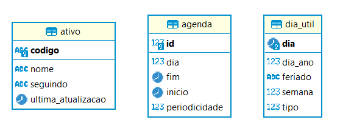

# MS Automatico

A finalidade deste microserviço é ser responsável por um agendamento da execução de scrapings de leitura de dados de ativos.

O agendamento deve ocorrer respeitando algumas premissas:

- Ser executado em um dia útil;
- Possuir um controle de quais ativos já participaram do processo no dia, em caso de leitura de dados já realizada, não deverão ser incluídos em uma nova requisição;
- Verificar que o scraping seja executado somente para os ativos estão sendo seguidos.

### Dependências

Para executar este projeto é necessário um **banco de dados** e um serviço de mensageria **RabbitMQ**.

O banco de dados é responsável por persistir dados referentes à ativos, dias úteis e agenda.

O serviço de mensageria recebe os eventos de solicitação de scraping. Também servirá como receptor de eventos de confirmação da execução com sucesso do processo de scraping.

### Banco de dados
O arquivo documents/dia_util.sql possui a definição completa de dias úteis e feriados nacionais de 2022 até 2052.

Abaixo, o diagrama ER da primeira versão:

Descrição das tabelas:

| Nome     | Descrição                                                                                                                                                                                                                                                                                                                 |
|----------|---------------------------------------------------------------------------------------------------------------------------------------------------------------------------------------------------------------------------------------------------------------------------------------------------------------------------|
| Ativo    | **Seguindo:** Define quando o MS irá enviar o ativo para solicitar scraping   **Ultima_atualizacao**: Mantém a data da última cotação do ativo                                                                                                                                                                         |
| Agenda   | **Dia**:   0 - Segunda   1 - Terça   2 - Quarta   3 - Quinta   4 - Sexta   5 - Sábado   6 - Domingo   7 - Todos os dias   **Inicio**: Hora e inicio    **Fim**: Hora que a agenda encerra   **Periodicidade**: Tempo em minutos entre tentativas de scraping dentro do período da agenda |
| Dia_util | **Dia_ano**: Dia do ano  **Feriado**: Em caso do dia ser um feriado, descrição de qual feriado é.   **Semana**: Semana do ano   **Tipo**:  Tipo do dia 0 - Dia útil 1 - Fim de semana 2 - Feriado                                                                                                        |
